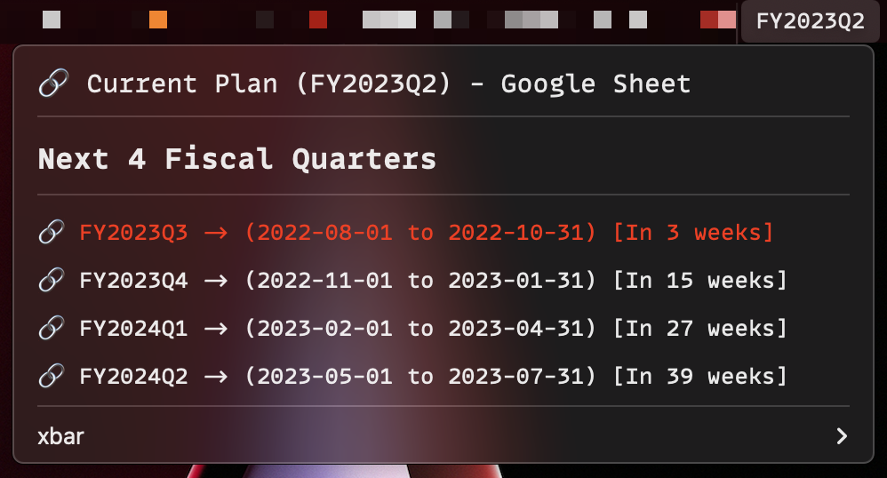
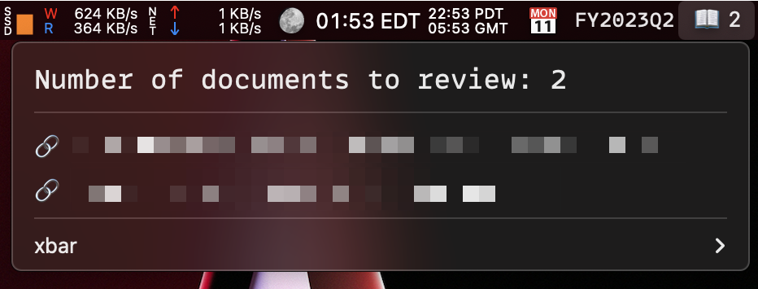

# Custom [xbar](https://xbarapp.com/) Plugins

In the `plugins` directory are custom [xbar](https://xbarapp.com/) plugins made by yours truly. I don't care if you use them for your own purposes. For whatever reason, I have not published them in the official repository.

The plugins are provided "as is", blah blah blah.

## How to Install

1. Download [xbar](https://xbarapp.com/).
1. Copy one of the scripts in this repository's `xbar/plugins` folder into the default location: `~/Library/Application Support/xbar/plugins`.
1. Make sure that the script that you've copied is executable (`chmod +x <script_name>`).
1. Open the preferences for xbar and make sure that you fill out any variables that you would like to change.

## Plugin Descriptions

### [Let's Get Fiscal - a Fiscal Calendar helper](plugins/lets-get-fiscal.1d.py)

This plugin adds the current quarter to your menubar, with a menu showing you the next quarters, when they are occurring, and relevant links that might be useful. It looks like this:

By default, the cadence it updates is once per day. You can change that by changing the time in the filename itself.

If you for some reason want to change the quarters, feel free to edit the Q1/Q2/etc. variables in [the xbar preferences for the plugin](images/lets-get-fiscal-prefs-window.png). All month numbers must be enumerated in these variables, and there must be no duplicates. Months start at 1 (January) and go to 12 (December)

The `Current plan link` can be an arbitrary link to whatever you would like. For me, I set it locally to one of the plan documents used at work.

### [Jira Document Ticket Reviewer](plugins/jira-review-tickets.5m.py)

This plugin shows me how many Jira tickets are currently waiting for my review. It looks like this:

Each item is clickable, and will bring you either to the filter that has the same query that populates it or the ticket itself. You must generate an OAuth token/secret/consumer_key and cert and place these values in the plugin's preferences. The cert needs to be stored on-disk in a file that you provide the path to in the plugin's preferences.

Additionally, you must specify the JQL for the filter you're going to use in the plugin's preferences. This is set in the "Jira search query" preference.
